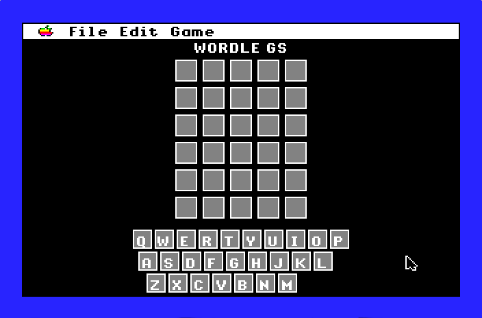

# WORDLE GS
A clone of WORDLE for the Apple IIGS. Latest release is [Version 0.4](https://github.com/dmalec/Wordle.GS/releases/tag/v0.4)

## Screen Shots

There is currently no manual for WORDLE GS. The screenshots below attempt to capture key aspects of playing the game.

### Start Screen

WORDLE GS starts up with a randomly selected secret five letter word which you have six attempts to guess.



### Play Screen

During play, squares will be highlighted to indicate correctly placed letter, incorrectly places letters, and letters which do not appear in the word.


### Results Dialog

Once the word is guessed (or all six guesses have been used), a dialog will show statistics about the number of attempts used to guess words in the current play session as well as giving the option to share a spoiler free summary of the guesses used for this word. 


### Share Dialog

The share dialog displays:

- The code used to generate the sequence of words
- The number of attempts used and the status of each attempt
- Which word number in the sequence was being guessed


### Enter Code Dialog

The _File_ > _New Game_ menu item allows the player to enter a code so they can try a shared word and compare their results to a friend's.


## As Seen On...

Ron McAdams of Ron's Computer Videos played Wordle GS on [his livestream](https://youtu.be/fyzRyB9RvmM) - this is a great introduction to the game.

## Dev Environment

This project is currently developed in [Xcode](https://developer.apple.com/xcode/) on OSX using:

* [Apple2GSBuildPipeline](https://github.com/jeremysrand/Apple2GSBuildPipeline) build system by Jeremy Rand
* [Golden Gate](https://goldengate.gitlab.io/about/) compatibility layer by Kelvin Sherlock
* [ORCA](https://juiced.gs/vendor/byteworks/) C compiler and libraries by The Byte Works

and tested on [GSplus](https://apple2.gs/plus/) and a physical ROM03 machine

## Unit Test Environment

This project does unit testing using:

* [Cpputest](https://cpputest.github.io/index.html) for unit testing
* [cpputest-starter-project](https://github.com/jwgrenning/cpputest-starter-project) as the basis for the unit test Makefile
* [gcov](https://gcc.gnu.org/onlinedocs/gcc/Gcov.html) and [lcov](http://ltp.sourceforge.net/coverage/lcov.php) for coverage reporting

After cloning, run the following starting from the root directory to run the unit tests:

```bash
git submodule update --init --recursive
cd test/cpputest
autoreconf . -i
./configure
make tdd
cd ..
make
```

If you have `lcov` and `gcov` installed locally, you can run the following `make` command instead:

```bash
make lcov
```
