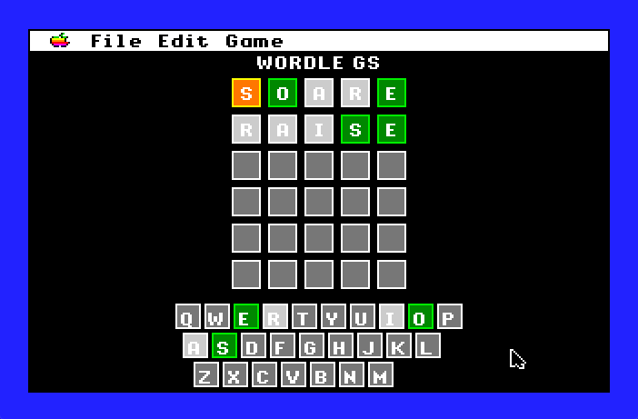

# Wordle.GS
A clone of Wordle for the Apple IIGS. Latest release is [Version 0.2](https://github.com/dmalec/Wordle.GS/releases/tag/v0.2)

## Screen Shots

### Sample Start Screen


### Sample Play screen



### Sample Win Screen


## Dev Environment

This project is currently developed in [Xcode](https://developer.apple.com/xcode/) on OSX using:

* [Apple2GSBuildPipeline](https://github.com/jeremysrand/Apple2GSBuildPipeline) build system by Jeremy Rand
* [Golden Gate](https://goldengate.gitlab.io/about/) compatibility layer by Kelvin Sherlock
* [ORCA](https://juiced.gs/vendor/byteworks/) C compiler and libraries by The Byte Works

and tested on [GSplus](https://apple2.gs/plus/) and a physical ROM03 machine

## Unit Test Environment

This project does unit testing using:

* [Cpputest](https://cpputest.github.io/index.html) for unit testing
* [cpputest-starter-project](https://github.com/jwgrenning/cpputest-starter-project) as the basis for the unit test Makefile

After cloning, run the following starting from the root directory to run the unit tests:

```bash
git submodule update --init --recursive
cd test/cpputest
autoreconf . -i
./configure
make tdd
cd ..
make
```
